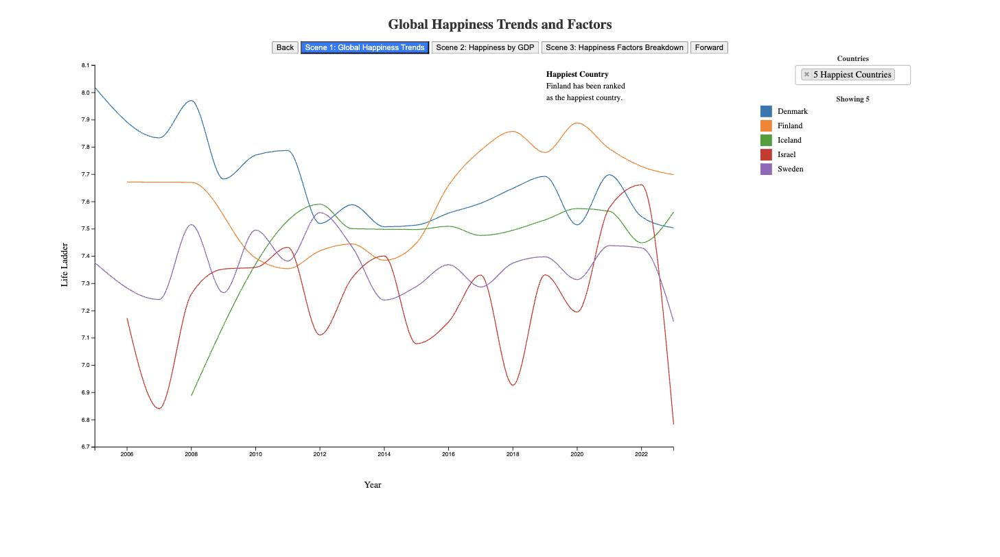

# world-happiness-explorer

Three linked D3 scenes over the [World Happiness Report](https://worldhappiness.report/)
(2005-2023, ~165 countries): what happiness looks like over time, how it tracks income, and what
a country's score is actually made of.

**[Open the live version →](https://gclluch.github.io/world-happiness-explorer/)**



D3 v6 written by hand - no charting library, no build step, no framework. Four JS files and two
CSVs served as static assets.

## The three scenes

**1. Global happiness trends.** Every country's Life Ladder score from 2005 to 2023. All ~165 at
once is deliberately a thicket - the shape and spread of the distribution is the point, and the
annotations mark its edges (Finland at the top, Afghanistan falling away after 2020). The
**Countries** filter cuts it to something readable, and a legend naming each line appears once the
selection is small enough to fit. Hovering any line dims the rest and identifies it.

**2. Happiness vs GDP.** Life Ladder against log GDP per capita for a chosen year. The relationship
is strong and obviously not the whole story - the vertical spread at any given income level is the
interesting part.

**3. What makes up a score.** Each country's score decomposed into the report's six regression
terms - log GDP, social support, healthy life expectancy, freedom to make life choices, generosity,
perceptions of corruption - plus **Dystopia + residual**. Click a legend swatch to drop a factor
and re-sort.

That last band deserves a note, because it is easy to misread. It is *not* purely "unexplained".
It is the report's Dystopia benchmark - a fixed constant representing a hypothetical worst-case
country, which every real country scores above - plus each country's actual residual. It is the
largest single band for **75 of 140 countries** (log GDP per capita is largest for 61), and
averages **1.58** against a mean Ladder score of **5.53**. So a substantial share of every score
is a constant offset rather than anything measured.

## Running it locally

The CSVs are loaded with `fetch`, so `file://` will not work - it needs a server, any server:

```bash
git clone https://github.com/gclluch/world-happiness-explorer
cd world-happiness-explorer
python3 -m http.server 8000
# then open http://localhost:8000
```

Nothing to install. D3, jQuery and select2 load from CDNs at runtime.

## Data

| File | Rows | What |
|---|---|---|
| `happiness_by_year.csv` | 2,363 | Country-year panel: Life Ladder plus the factor columns, 2005-2023 |
| `happiness_summary.csv` | 140 | One row per country for the most recent year, used by scene 3 |

Both come from the World Happiness Report's public data release. "Life Ladder" is the report's own
name for the Cantril ladder question - respondents place their life on a 0-10 scale - so it is
self-reported wellbeing, not a computed index. The factor columns are the report's own regression
terms, which is why they sum to less than the score and leave the Dystopia + residual remainder.

## Known limitations

- Scene 3's x-axis is labelled "Country" without individual country names; identify a bar by
  hovering it.
- Scene 3 drops Bahrain, State of Palestine and Tajikistan, which have missing factor columns.
- The decomposition is the World Happiness Report's own regression, reproduced - not an independent
  model. Read the bands as that report's explanation of its own score.
